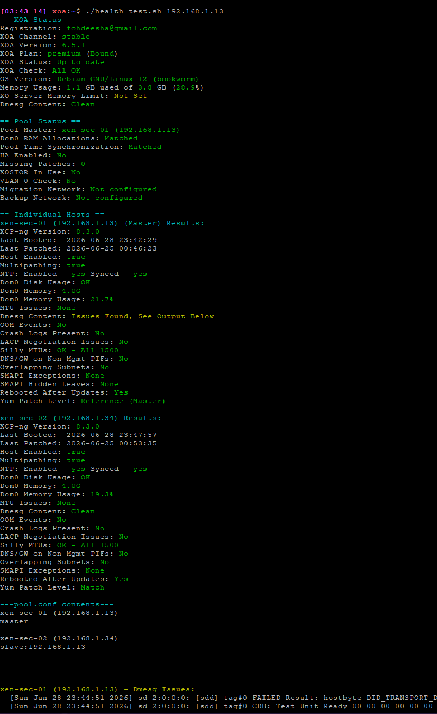

# xcp-stuff
Home of the XCP-ng infra health check script & misc xcp tooling

## how to use
Run the health.sh script on an XOA appliance with no arguments, it will pull pool/host information from XOA's database.  

- If XOA is connected to more than one pool, it lists the enabled pools and asks which one to check
- You can also provide a pool's name or part of a name with "-n", (for example, "-n pri" would match XEN-PRIMARY) or by giving the IP of the pool master directly
- Providing the password is not necessary, it will be pulled from XOA.
- If the host/pool is not in XOA, you can manually specify the pool master IP and password
- If the host it's checking is part of a pool, it will health check every pool member, unless you provide "-s" for single host check only
```
[03:34 14] xoa:~$ ./health.sh --help
Usage:
  ./health_test.sh [-f] [-s] [-n name] [pool_master_or_host[:ssh_port] [root_password]]

  - All parameters are optional
  - If a host is not supplied, the enabled pools in xo-server-db are listed to pick from
    (a single enabled pool, or non-interactive use, just takes the first one)
  - If a password is not supplied, it will be looked up locally in xo-server-db
  - By default, the script runs in pool mode (checks all hosts in the pool)
  - Use '-f' flag to filter output to only show issues found
  - Use '-s' flag to only check the specified host (do not check other pool members if present)
  - Use '-n' to pick a pool from xo-server-db by name instead of being prompted:
    the first pool whose name contains the text is used, matched anywhere in the
    name and ignoring case, so '-n sec' matches 'XEN-SECONDARY'

  Examples:
  ./health_test.sh 192.168.1.5
  ./health_test.sh 192.168.1.6 'mypass'
  ./health_test.sh -s 192.168.1.7 'mypass'
  ./health_test.sh -n sec
  ./health_test.sh -f -n 'xen-main'
  ```

  ## Example Output

