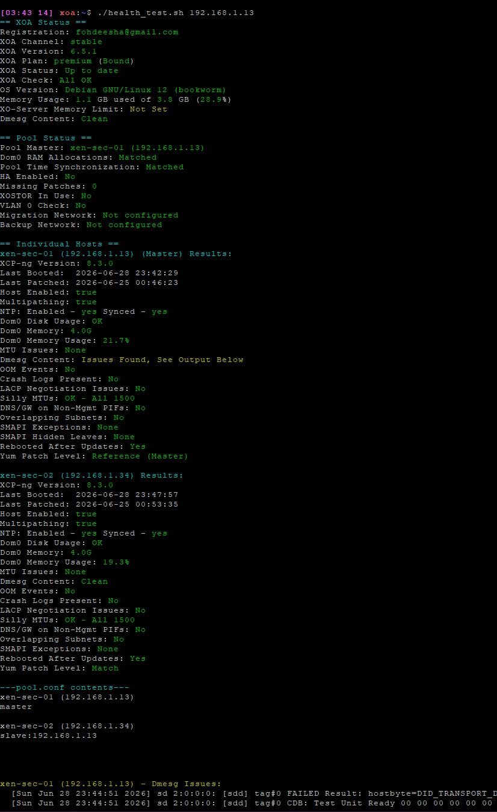

# xcp-stuff
Home of the XCP-ng infra health check script & misc xcp tooling

## how to use
```
# from XOA as root (no args = interactive menu to choose pool):
bash <(curl -fsSL https://raw.githubusercontent.com/Fohdeesha/xcp-stuff/main/health.sh)

# With args:
bash <(curl -fsSL https://raw.githubusercontent.com/Fohdeesha/xcp-stuff/main/health.sh) -n mainpool
```
That first command works just the same run directly on an XCP-ng host as root - the script
looks at `/etc/os-release` to see where it is and adapts. See
[Running it on an XCP-ng host](#running-it-on-an-xcp-ng-host-instead-of-xoa) below for what
differs there (`-n` is the one flag that doesn't apply, it needs XOA's database).

Run the health.sh script on an XOA appliance with no arguments, it will pull pool/host information from XOA's database.  

- If XOA is connected to more than one pool, it lists the enabled pools and asks which one to check
- You can also provide a pool's name or part of a name with "-n", (for example, "-n pri" would match XEN-PRIMARY) or by giving the IP of the pool master directly
- Providing the password is not necessary, it will be pulled from XOA
- If the host/pool is not in XOA, you can manually specify the pool master IP and password
- If the host it's checking is part of a pool, it will health check every pool member, unless you provide "-s" for single host check only
```
[03:34 14] xoa:~$ ./health.sh --help
Usage:
  ./health.sh [-f] [-s] [-n name] [pool_master_or_host[:ssh_port] [root_password]]

  - All parameters are optional
  - If a host is not supplied, the enabled pools in xo-server-db are listed to pick from
    (a single enabled pool, or non-interactive use, just takes the first one)
  - If a password is not supplied, it will be looked up locally in xo-server-db
  - By default, the script runs in pool mode (checks all hosts in the pool)
  - Use '-f' flag to filter output to only show issues found
  - Use '-s' flag to only check the specified host (do not check other pool members if present)
  - Use '-n' to pick a pool from xo-server-db by name instead of being prompted:
    the first pool whose name contains the text is used, matched anywhere in the
    name and ignoring case, so '-n sec' matches 'XEN-SECONDARY'

  Examples:
  ./health.sh 192.168.1.5
  ./health.sh 192.168.1.6 'mypass'
  ./health.sh -s 192.168.1.7 'mypass'
  ./health.sh -n sec
  ./health.sh -f -n 'xen-main'
  ```

## Running it on an XCP-ng host instead of XOA

The same script can be run directly on a host - it looks at `/etc/os-release` and adapts.
Useful when there is no XOA to hand, or when XOA cannot reach the pool.

```
# on the host, as root:
bash <(curl -fsSL https://raw.githubusercontent.com/Fohdeesha/xcp-stuff/main/health.sh)
```

- **This host is always checked**, using local commands - no ssh and no password involved.
- **The rest of the pool is checked too if you give a root password.** Pool members share
  the master's root password, so one covers the pool. With a terminal you are simply asked
  for it; you can also pass it as an argument, though the prompt is preferable since an
  argument is visible in `ps` and lands in your shell history. dom0 has no `sshpass`, so
  the script installs it the same way it does on XOA - from the stock `extras` repo
  (Vates' own mirror, already configured, just disabled), a 21KB package with no
  dependencies. `--enablerepo` is one-shot, so the host's yum config is left as it was.
- **With no password it checks this host alone and says so** - a `Hosts in Pool` line
  reports how much of the pool the run covered. Cron and piped runs take this path rather
  than hanging on a prompt.
- Pool-level results (pool master, HA, XOSTOR, VLAN 0, migration/backup network, migration
  compression, missing patches) are reported either way - those are `xe` queries, and xapi
  answers them from any pool member, slaves included.
- The XOA section is never printed (there is no appliance). Running on a host with a
  password otherwise produces the same report an XOA run does for that pool.
- `-f` and `-s` apply as usual; `-n` is XOA-only and is rejected with an explanation.

  ## Example Output

