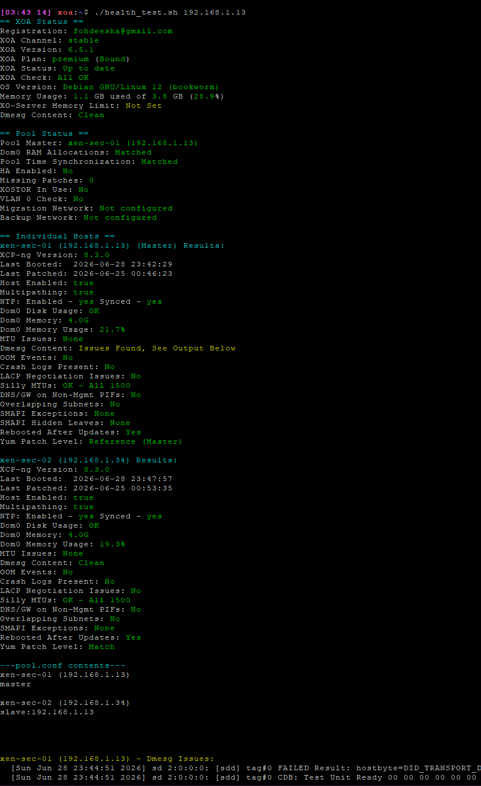

# xcp-stuff
Home of the XCP-ng infra health check script & misc xcp tooling

## Repair Scripts
Both run as root on the pool master, look before they touch anything, and
ask first. Download the file and run it, don't pipe it in from curl.

**storage-state-fixer.py** (8.3 only) - for when exports, backups or VBD unplugs start failing
because of storage junk left behind (dead dom0 datapaths, stale dom0 VBDs, stuck GC flags).
`check` just reports, `fix` shows the list and asks y/N. Editing storage.db restarts xapi on
that host (VMs keep running), with HA turned off and back on around it.
```
curl -fsSLO https://raw.githubusercontent.com/Fohdeesha/xcp-stuff/main/storage-state-fixer.py
python3 storage-state-fixer.py check
python3 storage-state-fixer.py fix
```
If a run gets cut off, `python3 storage-state-fixer.py recover` puts xapi and HA back. The first
time it reaches a pool host whose ssh key isn't already known, it shows the fingerprints and asks.
It asks for the pool root password too, unless `XCP_POOL_PASSWORD` is set (for wrappers that already
have it); if that one is refused, it falls back to asking.
Run records and storage.db backups go in `storage-state-fixer-data/` next to the script. The locks
it holds keep SM out; anything else that edits sm-config is caught by a last xapi event check.

**snapshot-fixer.py** (8.2 and 8.3) - fixes broken snapshot links in xapi's database: a VM or
disk that isn't a snapshot but still claims to be a snapshot of something, or a disk that's a
snapshot of itself. `dry-run` shows what it would change, `rewrite` does it (stops xapi, backs
the database up, fixes it, starts xapi, HA handled), `restore-backup` puts the backup back.
```
curl -fsSLO https://raw.githubusercontent.com/Fohdeesha/xcp-stuff/main/snapshot-fixer.py
python snapshot-fixer.py dry-run
python snapshot-fixer.py rewrite
```

## xo-config-recover
Gets your Xen Orchestra config out when an update broke XOA and the UI is dead. Same file
as *Settings → Config → Export*, no working xo-server needed. Run it on XOA as root:

```
python3 <(curl -fsSL https://raw.githubusercontent.com/Fohdeesha/xcp-stuff/main/xo-config-recover.py)
```

It drops `XO-config_<date>.json.gz` in the current dir, which you import back with
*Settings → Config → Import*. Only redis has to be up, and if it isn't it reads the last
`dump.rdb` instead. It doesn't change anything. Be aware the config file has every pool's root password in
it, same as a UI export.

| | |
|---|---|
| `--check` | show what it would export, write nothing |
| `--bundle` | also save a `.tar.gz` with a redis dump, the leveldb and the config files |
| `--passphrase-file FILE` | encrypt it like the UI's passphrase option |
| `--entries a,b` | only some sections |
| `-o FILE` | pick the file name, `-` for stdout |
| `-h` | full help |

Doesn't handle an encrypted credential database (`redis.encryptCredentialDatabase`) yet, it
just stops and tells you.

## Infra Health Check
Checks for 100+ of the most common XOA and XCP-ng issues across entire pools. Paste this on XOA as root:

```
python3 <(curl -fsSL https://raw.githubusercontent.com/Fohdeesha/xcp-stuff/main/health.py)
```

With no args it grabs the pool list and root passwords from XOA's database and asks which
pool to check (with only one pool, or no terminal, it just takes the first). Every host in
the pool gets checked. Nothing gets installed on XOA or the hosts, not even sshpass, so an
XOA with no internet works fine too - just copy the file over.

It has to run as root. On XOA do `sudo -i` first: `sudo python3 <(curl ...)` won't work,
because sudo closes the file descriptor `<( )` opens.

Args go on the end of the one-liner:

| | |
|---|---|
| `-n NAME` | pick the pool by name instead of from the menu. Partial match, any case, so `-n sec` finds XEN-SECONDARY |
| `IP [password]` | check a pool by its master's IP (`IP:port` for a different ssh port). Password's only needed if XOA doesn't have it, e.g. `-s` on a slave |
| `-s` | only check the host you gave it, not the rest of the pool |
| `-f` | findings only. Everything that passed is hidden, so a healthy pool prints almost nothing |
| `-c CMD` | run a command on every host in the pool instead of the health check (see below) |
| `--json` | the same run as JSON, for cron/monitoring (see below) |
| `-h` | full help |

```
health.py -n sec
health.py -f -n xen-main
health.py -s 192.168.1.7 'mypass'
```

Exit code is 0 if everything passed, 1 if anything flagged, 2 if you got the arguments wrong.

### On an XCP-ng host
The same one-liner works as root on an 8.3 host, it figures out where it's running. It
always checks the host it's on, and if you give it the root password (it'll ask if you're at
a terminal) it checks the rest of the pool too. No password just means this host only. `-n`
and `-c` need XOA, so they don't work here.

8.2.1 hosts have no python3, so it can't run on them. Check 8.2 pools from XOA instead, that
works fine.

### Running a command across the pool
`-c` runs one command on every host and prints what each one said, using the same pool and
password lookup as the health check. Handy for eyeballing something pool-wide without
writing an ssh loop. XOA only.

```
$ health.py -n sec -c 'cat /etc/resolv.conf'
Checking pool: XEN-SECONDARY (192.168.1.13)

== 192.168.1.13 ==
nameserver 192.168.1.1

== 192.168.1.34 ==
nameserver 192.168.1.1
```

It hits up to 8 hosts at once with no confirmation, so use it for looking at things, not
changing them. Exit code is always 0, and it can't be combined with `--json`.

### JSON output
`--json` gives you the same checks and exit code as one JSON document. Only the JSON goes to
stdout (banner and prompts go to stderr), so `health.py --json -n sec | jq` works as is.

- Alert on each check's `flags` field, not `status` or the color
- A host it couldn't reach has `reachable: false` and no `checks` at all, so don't read a
  missing list as healthy
- `-f` trims it the same way it trims the report
- No timestamp, so two runs of an unchanged pool diff clean


### How it works
Each host gets one ssh call, up to 8 at a time. A small collector goes over ssh stdin, grabs
everything, and sends back one JSON blob, so nothing's written to the host. Every fact comes
back as either a value or the reason it couldn't get one, so the report never shows green
for something it didn't actually check. The collector also runs on python 2.7, which is how
8.2.1 pools get checked from XOA.

It only needs python3's standard library, which XOA and 8.3 hosts already have.

### Working on it
`health.py` is built from `src/`, so don't edit it directly.
```
python build/stitch.py     # rebuild health.py after changing src/
python -m pytest tests/    # all offline, no hosts needed
```
GitHub rebuilds `health.py` on every push anyway, so `git pull` after pushing a `src/`
change. The old bash `health.sh` is retired and just points here now.

### Example Output



---

